<div align="center">

<!-- Animated Header -->


<br/>

<!-- Social Badges -->

[](https://saldang.it)
[](https://linkedin.com/in/salvatoredangelo86)
[](https://twitter.com/GeekYoghi)
[](mailto:s.dangelo86@icloud.com)
[](./DevCV.pdf)

</div>

---

## 🧬 About Me

```yaml
name: Salvatore D'Angelo
located_in: Marcianise, Italy 🇮🇹
current_role: Tech Lead @ Guild Living International Italy
academic_role: University Professor @ Università della Campania "L.Vanvitelli"
education: PhD in Industrial & Information Engineering (HPC, Cloud, Big Data)
languages: [Italian 🇮🇹 (native), English 🇬🇧 (C2)]

focus_areas:
  - Building tech products from scratch for elderly care & longevity
  - Teaching Advanced Software Engineering & OOP
  - DevOps, Kubernetes orchestration, CI/CD automation
  - LLM + RAG applications
  - Scalable distributed systems & cloud-native architectures
```

> _I bridge the gap between technical excellence and team leadership, fostering agile practices, continuous delivery, and infrastructure-as-code across organizations._

---

## ⚡ Tech Stack

<div align="center">

|       Domain       | Technologies                                                                                                                                                                                                                                                                                                                                                                                                                                                                                                                                                                                                                                                        |
| :----------------: | :------------------------------------------------------------------------------------------------------------------------------------------------------------------------------------------------------------------------------------------------------------------------------------------------------------------------------------------------------------------------------------------------------------------------------------------------------------------------------------------------------------------------------------------------------------------------------------------------------------------------------------------------------------------ |
|   **Languages**    |                                                                           |
|   **Frameworks**   |                                                                                                                                                                                                                                                                                                                                                      |
| **DevOps & Cloud** |       |
|   **Data & AI**    |                                                                                                                                                                                                                                                                                                                                                         |
|   **Databases**    |                                                                                                                                                                                                                                                                                                                                                                                                                                             |
|     **Other**      |                                                                                                                                                                                                                                               |

</div>

---

## 🚀 Career Journey

```mermaid
timeline
    title Professional Timeline
    2013-2016 : 🎓 PhD in Industrial & Information Engineering
              : HPC, Parallelizing Compilers, Cloud & Big Data
    2017-2019 : 🔬 Researcher @ CINI (H2020 Toreador)
              : 🎓 E-Learning Platform Manager
    2018-2024 : 🚀 Co-Founded Geekers S.r.l.
              : Cloud Native, Flutter, DevOps, IaC
    2019-2025 : 🔬 Researcher @ CINI (ML & NLP)
              : 🏋️ DevOps Training Instructor
    2021-2025 : 👨‍🏫 Adjunct Professor (Mobile Dev)
              : 🏗️ Technical Architect @ Healthware
    2022-now  : 👨‍🏫 University Professor (SW Engineering & OOP)
              : 🔬 University Researcher (ML/DL/Cloud)
    2025-now  : 💼 Tech Lead @ Guild Living International
              : Building longevity-focused tech from scratch
```



---

## 🎓 Academic Highlights

- **Ph.D.** in Industrial & Information Engineering — _HPC, Parallel Computing, Cloud & Big Data_
- **H2020 European Project** — Toreador: parallelization & dynamic management of Big Data apps
- **University Professor** — Advanced Software Engineering, OOP, Mobile Development
- **Published Research** — Machine Learning, Deep Learning, NLP, Cloud Computing, Code Generation

---

## 🏃 Beyond the Code

<div align="center">

🏋️ CrossFit &nbsp;|&nbsp; 🚴 Cycling &nbsp;|&nbsp; 🏃 Running &nbsp;|&nbsp; 🔧 Mechanics & Automotive

</div>

---

<div align="center">


<br/><br/>

_"The best way to predict the future is to build it."_

</div>
